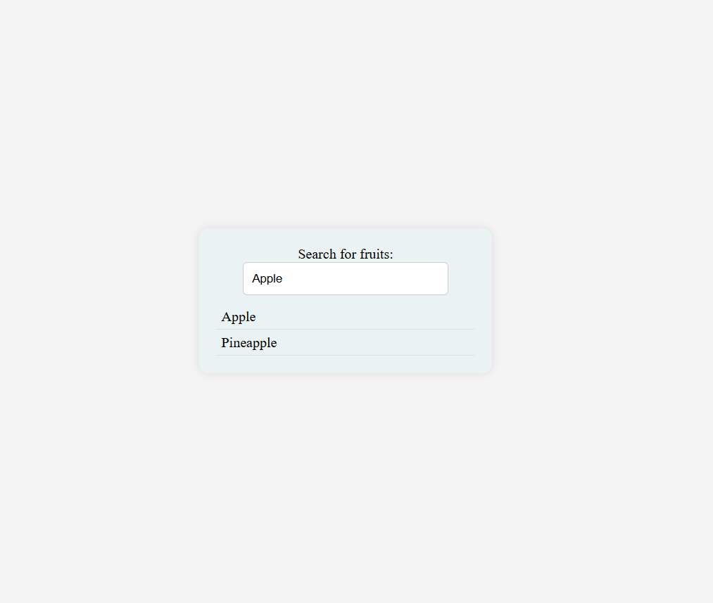

# 🍎 Fruit Search App

A simple and responsive Fruit Search application built with React. This app allows users to search for fruits and displays results dynamically using an external API.

## Screenshot

## 🚀 Features

- 🔍 Real-time fruit search with debounce (delay)
- ⚡ API integration for fetching fruit data
- 🧠 Efficient state management using React Hooks
- 🛑 Prevents unnecessary API calls with cleanup function
- 📱 Simple and clean UI

## 🛠️ Tech Stack

- React (Functional Components)
- JavaScript (ES6+)
- HTML5 & CSS3
- Fetch API

## ⚙️ How It Works

- User types in the search input field.
- The input value is stored in state using `useState`.
- A `useEffect` hook triggers after a short delay (debounce).
- API request is sent to fetch matching fruits.
- Results are displayed dynamically on the screen.
- Cleanup function ensures only the latest request is processed.

## 🌐 API Used

- https://fruit-search.freecodecamp.rocks/api/fruits

## 💻 Code Highlights

- Debouncing using `setTimeout`
- Cleanup using `clearTimeout`
- Controlled input field
- Async/Await with error handling

## 📌 Future Improvements

- Add loading spinner
- Show fruit images
- Improve UI with dropdown suggestions
- Add keyboard navigation support
- Highlight matched text

✨ Built with React and curiosity
